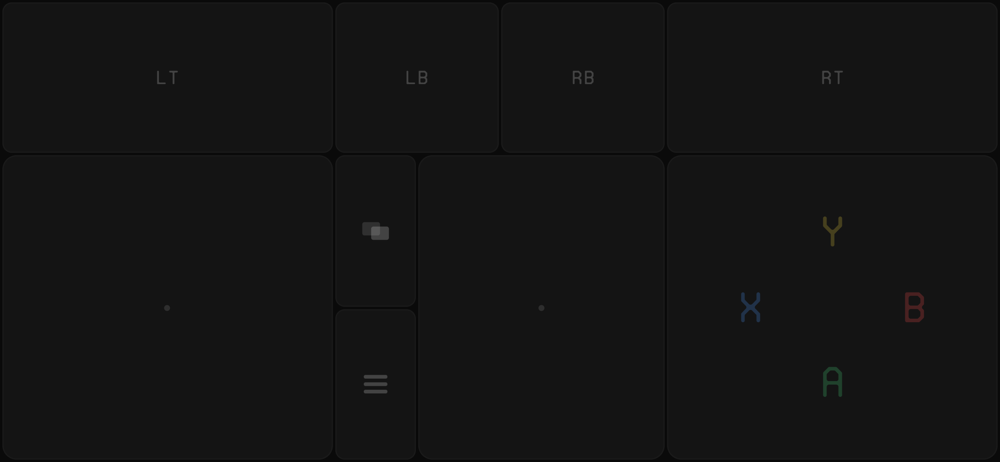
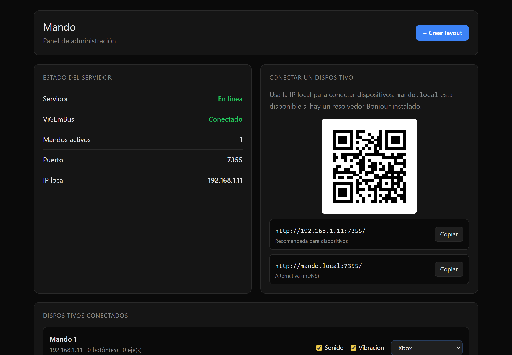

# Mando

Convierte uno o varios iPhones (u otros dispositivos con navegador) en mandos Xbox 360 virtuales para Windows.

- El PC ejecuta un servidor Bun en segundo plano.
- Crea un mando virtual por dispositivo conectado mediante ViGEmBus.
- Cada dispositivo se conecta por WiFi a una webapp táctil.
- Los mandos se detectan en Windows como controladores Xbox 360 reales (aparecen en `joy.cpl`).

## Capturas

<p align="center">
  
  <br>
  <strong>Webapp táctil</strong> — desde el navegador del iPhone
</p>

<br>

<p align="center">
  
  <br>
  <strong>Panel de administración</strong> — desde el navegador del PC
</p>

## Características

- Webapp táctil con joysticks, ABXY, shoulders, triggers, SELECT/START.
- Soporte multi-mando: cada dispositivo tiene su propio mando virtual.
- Panel de administración web en `/admin` con QR para conectar rápido.
- Descubrimiento mDNS (`mando.local`) — si no hay Bonjour, se conecta por IP local.
- Feedback sonoro (Web Audio API) y visual (radial glow + neón interior) al pulsar botones.
- PWA: se puede añadir a la pantalla de inicio del iPhone.
- Tray icon en la bandeja de Windows con inicio automático opcional.
- Sonido y vibración configurables por dispositivo desde el panel admin.
- Auto-instalación de ViGEmBus: si el driver no está instalado, se instala solo en primera ejecución.
- Layouts intercambiables: Xbox, GameBoy, Arcade, Fighter, Racing, Shooter.
- Editor de layouts visual (drag & drop desde el panel admin).

## Instalación

Descarga `mando.exe` desde la sección [Releases](https://github.com/verdulife/mando/releases) y ejecútalo.

- **Primera ejecución:** si ViGEmBus no está instalado, Mando lo descargará e instalará automáticamente (requiere permisos de administrador — el programa se re-lanzará solo si es necesario).
- **Ejecuciones posteriores:** Mando arranca directamente, ya sea manualmente o con el inicio automático de Windows.

### Requisitos

- Windows 10/11 x64.
- Opcional: resolvedor mDNS/Bonjour (iTunes, iCloud o Bonjour Print Services) para usar `mando.local`.
- Opcional: conexión WiFi para conectar dispositivos.

## Cómo usar

1. Ejecuta `mando.exe` (el icono aparece en la bandeja del sistema).
2. Conecta el PC y los dispositivos a la misma red WiFi.
3. El panel de admin se abre automáticamente (o haz clic en el icono de la bandeja → "Abrir panel").
4. Escanea el código QR o escribe la URL en el navegador del dispositivo.
5. Usa los controles táctiles.
6. Para verificar: abre `joy.cpl` (Win + R → `joy.cpl`) — aparecerá un controlador Xbox 360 por cada dispositivo conectado.

También puedes abrir la webapp directamente desde el PC en `http://localhost:7355`.

## Desarrollo

```powershell
git clone https://github.com/verdulife/mando.git
cd mando
bun install
bun run dev
```

Por defecto escucha en el puerto `7355`. Puedes cambiarlo con:

```powershell
$env:PORT=8080; bun run dev
```

### Compilar ejecutable

```powershell
bun run build
```

Genera `dist/mando.exe` con todo embebido (webapp, ViGEmClient.dll, e instalador de ViGEmBus).

### Lanzar un release

```powershell
git tag v0.1.0
git push origin v0.1.0
```

GitHub Actions compila automáticamente y crea un Release con `mando.exe` adjunto.

## Notas

- **Firewall:** la primera vez que lo ejecutes, Windows puede pedir permisos de red. Acepta.
- **mDNS:** si `mando.local` no funciona, usa la IP local que muestra el panel de administración.
- **Anti-virus:** el ejecutable compilado puede dar falsos positivos por no estar firmado. Es normal.
- **Portabilidad:** `mando.exe` es autocontenido — puedes copiarlo a cualquier carpeta y ejecutarlo.
